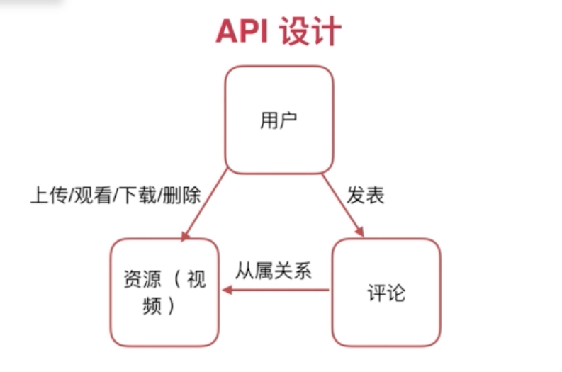
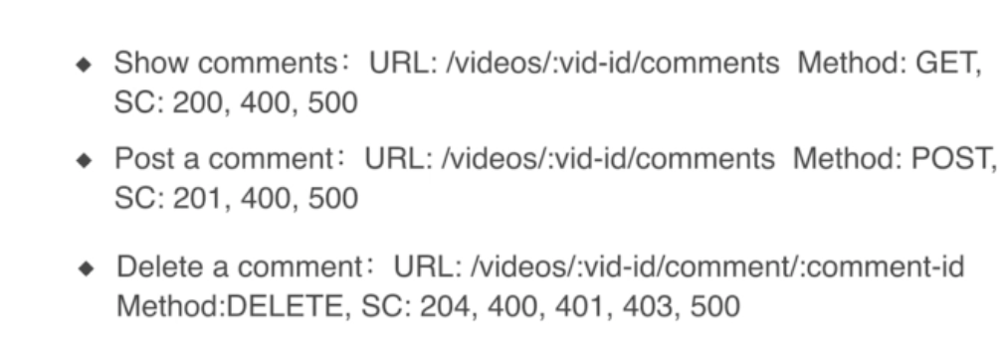
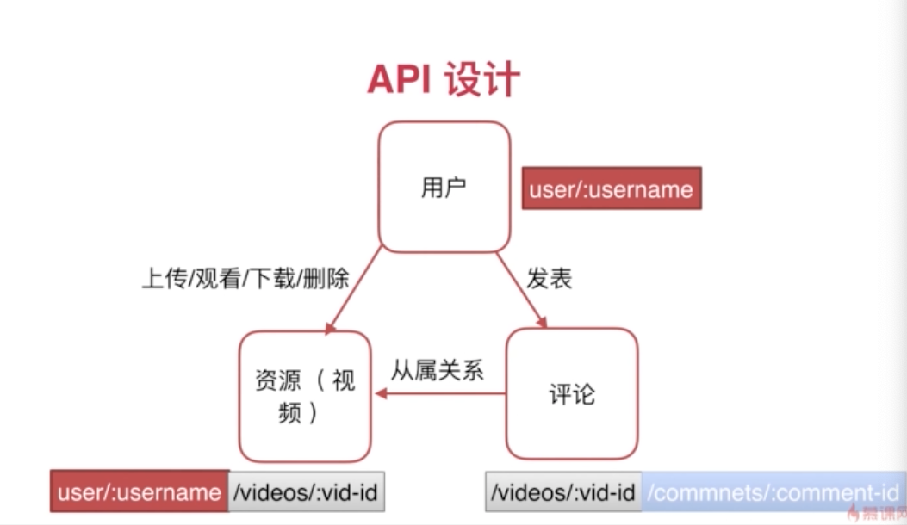

大前端

现在的前端, 都有个webserver.
现在的前端
后端 cap: availability

pro:
- 性能的提升

cons:
- 工作量大
- 学习成本
- 系统的复杂度加大

api:
- restful是一种风格, 而不是协议
- 协议是http, json

restful api的特点:
- 接口风格统一(Uniform Interface)
- 无状态(Stateless)
- 可缓存(Cachable)
- 分层(Layered System)
- CS 模式(client server模式)

# API  设计
API 设计原则
- 以URL统一资源定位服务 API
- 通过不同的method get post *put delete CRUD
- 返回码(Status Code)符合http资源描述的规定

## cr图 资源, 映射到 api method里

## api 用户
- 登录 注册 
/user POST SC(Status Code): 201, 400, 500
201 created
200 是ok(get)

用户登录 url:/user/:username method:post sc:200, 400, 500

获取用户基本信息: /user/:username GET: 200, 400, 401, 403
401: 验证不通过, 
403: 权限不够

用户注销: DELETE 204, 400, 401, 403, 500
204: No content

## 用户资源
- List all videos: 
- /user/:username/videos 可能会加分页
- Get one video:
- /user/:username/videos/:vid 
- Delete one video
- 204, 400, 401, 403, 500

## 评论
show comments:
/videos/:vid-id/comments Method: GET, SC 200, 400, 500
Post a comment:
/videos/vid/comments Method: POST, SC 201

## 总结
* 树形结构 * 的关系 user -> video -> comments

## 正常的流程
hanlder -> validation(1. request, 2.user)-> business logic -> response
*! session
